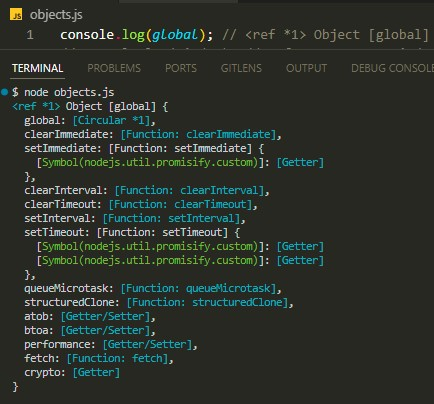
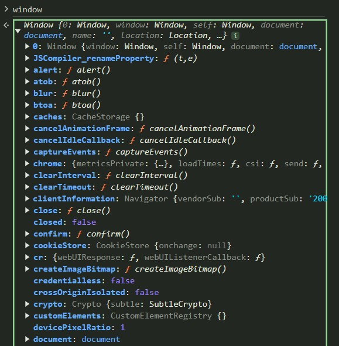
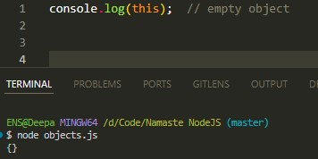
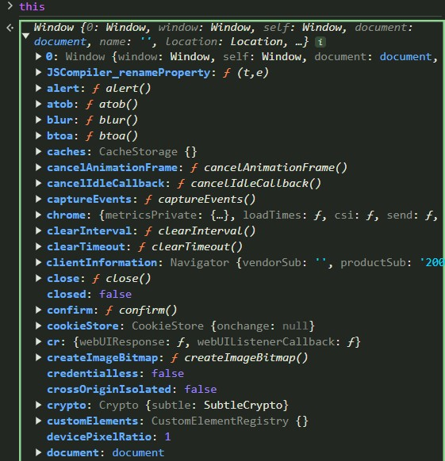
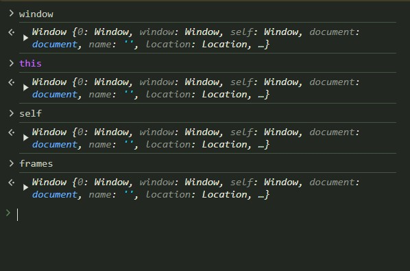
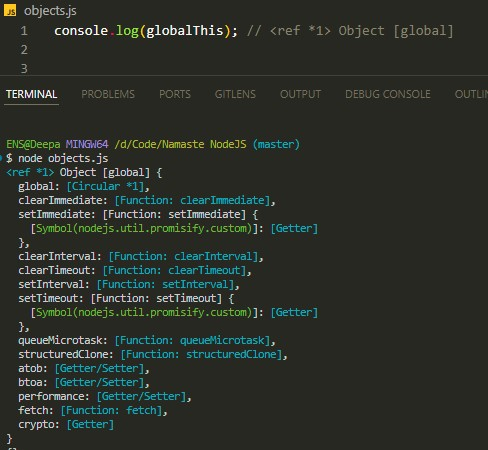
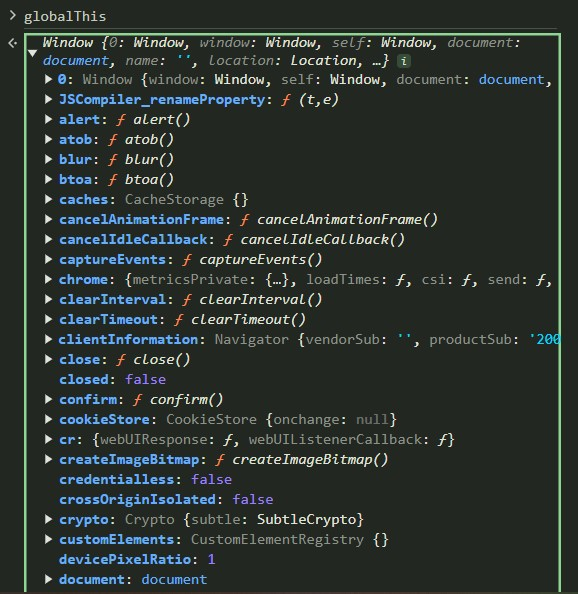

# Namaste NodeJS 🚀

## Episode 1 - Introduction to NodeJs
### 🚀 Key Takeaways from Node.js Episode 1!
This episode dives deep into the fascinating history of Node.js—how it was created and how it revolutionized server-side JavaScript. It’s incredible to see how it transformed the developer ecosystem!

🌟 Highlights of Node.js Evolution:
1️⃣ 2009:
Created by Ryan Dahl, addressing the need for a non-blocking I/O system.
Powered by Google's V8 engine (used in Chrome).
2️⃣ 2010:
Launch of npm (Node Package Manager), simplifying JavaScript package sharing and management.
3️⃣ 2011:
 - Windows support added, expanding accessibility.
 - Collaboration with Joyent and Microsoft for development.
4️⃣ 2012:
 - Isaac Schlueter takes over npm's leadership, fostering its growth.
5️⃣ 2014:
 - io.js, a fork of Node.js, emerges to accelerate innovation.
6️⃣ 2015:
 - Node.js and io.js reunite under the Node.js Foundation, ensuring collaborative progress.
7️⃣ 2019:
 - Transition to the OpenJS Foundation, promoting unity across JavaScript ecosystems.

💡 Why Node.js Is a Game-Changer:
Node.js’s non-blocking I/O model enables highly efficient, scalable applications—from lightweight APIs to enterprise-level systems. It has redefined what's possible in server-side JavaScript development.

## Episode 2 - JS on Server
### 🚀 Key Takeaways from Node.js Episode 2!
This episode dives deep into the fascinating what is server, what is V8 Engine, how does it works behind the scene.
#### What is server?
 - Server is nothing but a remote computer / cpu.
 - when javascript come on the server, it gives us the opportuinity to develop the full stack application.
 - Node.js is C++ code.
 - Even V8 Engine is written in C++ program.
#### What is V8 engine?
 - V8 is Google's open source high-performance JavaScript and WebAssembly engine, written in C++.
 - V8 can be embedded into any C++ application.
 - The job of V8 engine is to execute the JS code.
<pre>
 Javascript -----> V8 Engine -----> Machine code
                   |  C++ code
                   |
                   Reading JavaScript code
 </pre>
 - Node JS is a C++ application with V8 embedded into it.
 - V8 is a  JS Engine that follows ECMAScript standards.
#### What is ECMAScript?
 - ECMAScript is a standard for scripting langauge like Javascript, JScript, ActionScript etc.
 - ECMAScript is a standards / rules that JS Engine follows.

So, V8 follows the ECMAScript standards and Node.js gives the extra super power.

#### V8 is a C++ code. What does it do & wy it is a C++ code
<pre>
                  Programmer
                      | 
                      | write
                      &darr;
          Javascript Code(High level code)
                      |
                      | Processed by
                      &darr; 
                  C++ (JS Engine)
                      |
                      | Converts
                      &darr;
                  Machine Code
                      | This machine code 
                      | understandable by the computer
                      &darr;
                Computer(Binary Code)
</pre>

## Episode 3 - Let's write code
### 🚀 Key Takeaways from Node.js Episode 3!
This episode dives deep into the fascinating what is window object, global object in browser and in nodejs. How does it works behind the scene.

 - As in browser, the global object is "window". Same in Node.js the global object is "global".
 - "global" is not the part of the V8  engine and it is one of the Super power of Node.js. Which is given to use by node.js.

### When we console "global" and "window" we get 
 
#### This is in Node js

 

#### This same will happen incase of browser when we console window on the Browser
 

### When we console "this' in Node JS and in Browser
#### In Node js it refers to an empty object
 

#### In Browser "this" refers to the same object, "window" but its not the same case.
 

### In browser if we write "window", "this", "self", "frames" all of these gives the global object.

 

 - Node js started using "global" as global object.
 - Because of this there is lot of confusion and after that "Open JS Foundation" comes up with a standard global object for all the runtime environment and there should be a single way to represnt it.
 - So, finally in 2020 Open JS Foundation comes up with "globalThis" object in ECMSScript2020, and globalThis refers to global object in all javascript runtime.

### Node JS

 

 ### Browser
 

